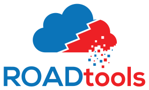
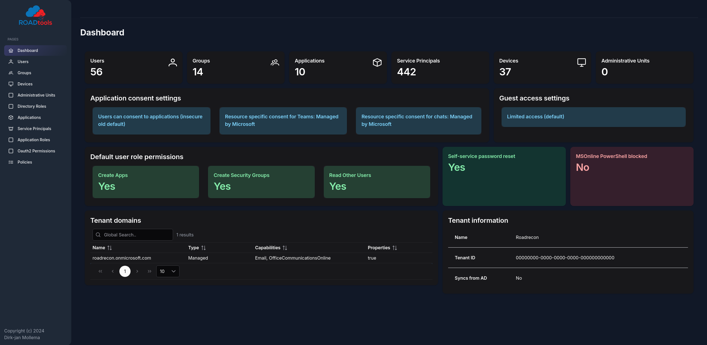
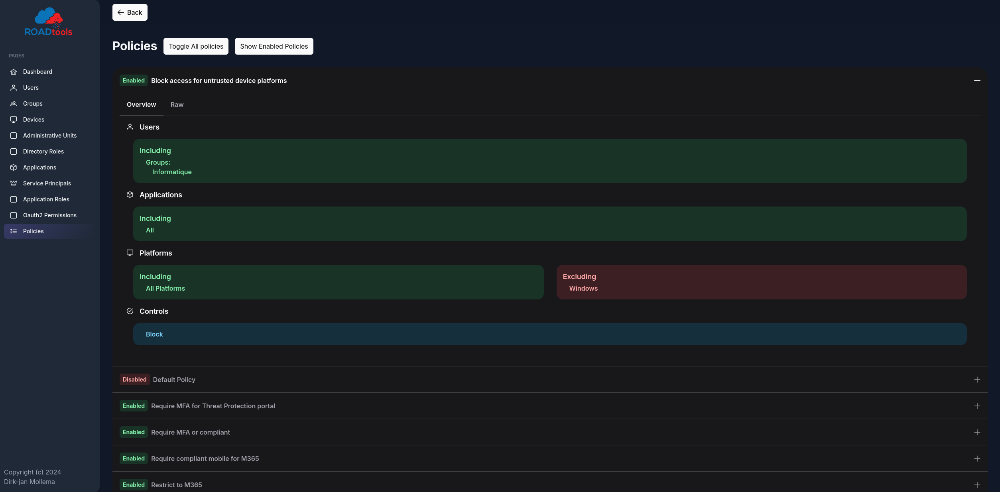

# ROADtools 
*(**R**ogue **O**ffice 365 and **A**zure (active) **D**irectory tools)*




ROADtools is a framework to interact with Azure AD. It consists of a library (roadlib) with common components, the ROADrecon Azure AD exploration tool and the ROADtools Token eXchange (roadtx) tool.

## Roadrecon UI NG



### Install

#### Docker setup

```
cd roadrecon
# copy the roadrecon.db to roadrecon/
sudo docker-compose up -d
```

Enjoy on port 5173 (port 5000 is used for the backend and does not include the old UI build anymore)

#### Docker setup

```
cd roadrecon
# copy the roadrecon.db to roadrecon/

pip install .

# OR

pipx install git+https://github.com/synacktiv/ROADtools --include-deps
```

And then start the server:
```
roadrecon gui
```
Enjoy on port 5000


### New features



- New Frontend based on Vite, VueJS and PrimeVue framework
- Backend pagination for better performance on large databases
- Added a Policies detail page

## Credits

- Dirk-jan Mollema as the original author of the backend and the tool suite
- Kevin Tellier from Synacktiv for the new UI
- Template by [Cruip.com](https://cruip.com/)

## ROADlib


ROADlib is a library that can be used to authenticate with Azure AD or to build tools that integrate with a database containing ROADrecon data. The database model in ROADlib is automatically generated based on the metadata definition of the Azure AD internal API. ROADlib lives in the ROADtools namespace, so to import it in your scripts use `from roadtools.roadlib import X`

## ROADrecon

[](https://dev.azure.com/dirkjanm/ROADtools/_build/latest?definitionId=19&branchName=master)

ROADrecon is a tool for exploring information in Azure AD from both a Red Team and Blue Team perspective. In short, this is what it does:
* Uses an automatically generated metadata model to create an SQLAlchemy backed database on disk.
* Use asynchronous HTTP calls in Python to dump all available information in the Azure AD graph to this database.
* Provide plugins to query this database and output it to a useful format.
* Provide an extensive interface built in Angular that queries the offline database directly for its analysis.

ROADrecon uses `async` Python features and is only compatible with Python 3.7 and newer (development is done with Python 3.8, tests are run with versions up to Python 3.11). 

### Installation
There are multiple ways to install ROADrecon:

**Using a published version on PyPi**  
Stable versions can be installed with `pip install roadrecon`. This will automatically add the `roadrecon` command to your PATH.

**Using a version from GitHub**  
Every commit to master is automatically built into a release version with Azure Pipelines. This ensures that you can install the latest version of the GUI without having to install `npm` and all it's dependencies. You can download the `roadlib` and `roadrecon` build files from the [Azure Pipelines artifacts](https://dev.azure.com/dirkjanm/ROADtools/_build/latest?definitionId=19&branchName=master) (click on the button "1 Published". The build output files are stored in `ROADtools.zip`. You can either install the `.whl` or `.tar.gz` files directly using pip or unzip both and install the folders in the correct order (`roadlib` first):

```
pip install roadlib/
pip install roadrecon/
```

You can also install them in development mode with `pip install -e roadlib/`.

**Developing the front-end**  
If you want to make changes to the VueJS front, you can specify an environment variable TARGET in order to build the dev environment:
```
cd roadrecon
TARGET=dev docker-compose up -d
```

You can run the Angular frontend with `npm start` or `ng serve` using the Angular CLI from the `roadrecon/frontend/` directory. To build the JavaScript files into ROADrecon's `dist_gui` directory, run `npm build`.

### Using ROADrecon
See [this Wiki page](https://github.com/dirkjanm/ROADtools/wiki/Getting-started-with-ROADrecon) on how to get started.

## ROADtools Token eXchange (roadtx)

[](https://dev.azure.com/dirkjanm/ROADtools/_build/latest?definitionId=19&branchName=master)

roadtx is a tool for exchanging and using different types of Azure AD issued tokens. It supports many different authentication flows, device registration and PRT related operations. For an overview of the tool, see the [roadtx Wiki](https://github.com/dirkjanm/ROADtools/wiki/ROADtools-Token-eXchange-(roadtx)).

### Installation
There are multiple ways to install roadtx. Note that roadtx requires Python 3.7 or newer.

**Using a published version on PyPi**  
Stable versions can be installed with `pip install roadtx`. This will automatically add the `roadtx` command to your PATH.

**Using a version from GitHub** 
You can clone this repository and install `roadlib` and then `roadtx` to make sure you have the latest versions of both the tool and the library:

```
pip install roadlib/
pip install roadtx/
```

You can also install them in development mode with `pip install -e roadtx/`.

### Using roadtx
See [the Wiki](https://github.com/dirkjanm/ROADtools/wiki/ROADtools-Token-eXchange-(roadtx)) on how to use roadtx.
